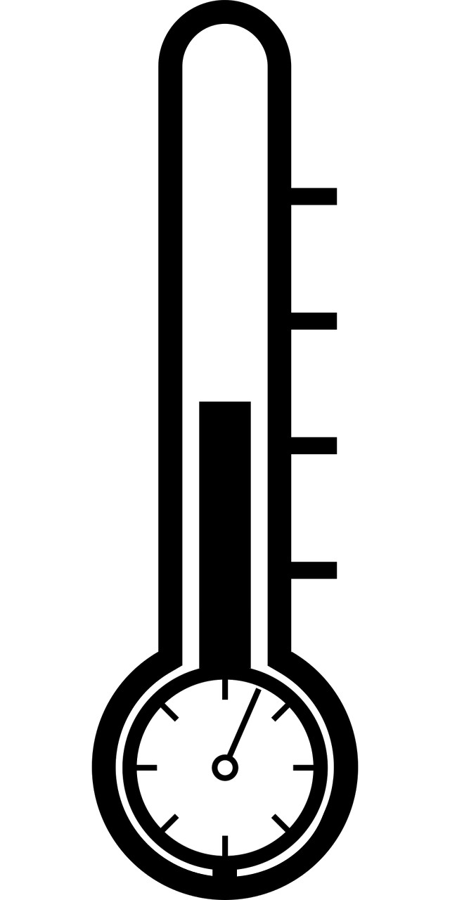

# THAPMU
THAPMU stands for **T**emerature, **H**umiditity and **A**ir **P**ressure **M**easurement **U**nit.

## Story
I wanted to monitor the temperature of several rooms and wanted to display the measurements on a website.
I also wanted to have it as cheap and easy to use as possible.
I searched on the internet and i found a very good looking sensor and esp combo.
It was not perfect but looked promising.
I read the reviews about it and i was very disapointed.
There were only complains about the product.
I thought, it should not be that hard to combine an esp wlan module and an measurement instrument.
I decided for an esp-01 and for an bme280 sensor, because of his wide range of usability.
To be as easy to use as possible I added also a serial adapter to the whole thing.
So everyone is able to program and power the unit very easily.

## Hardware
This is a very simple project. As a basis I took inspiration of the xxx serial adapter.
I modified the circuit and the layout to fit the requirements of the esp and the sensor.
To keep the project as simple as possible I did not integrate the esp and the sensor.
They are both normal boards to plug into the modified serial adapter.

## Software
I designed the software in Arduino IDE.

## Credits
[KGeri201](https://github.com/KGeri201)

## License
[GNU GENERAL PUBLIC LICENSE](https://choosealicense.com/licenses/gpl-3.0/)

## Project status
In development.
